<h1 id="title" align="center">SD-πXL: Generating Low-Resolution Quantized Imagery via Score Distillation (SIGGRAPH Asia 2024)</h1>

<p align="center">
    <a href="https://www.python.org/"></a>
    <a href="https://opensource.org/license/MIT"></a>
    <!-- <a href="https://https://alexandrebinninger.com/"></a> TODO -->
    <a href="https://doi.org/10.1145/3680528.3687570"></a>
</p>


<div align="center">
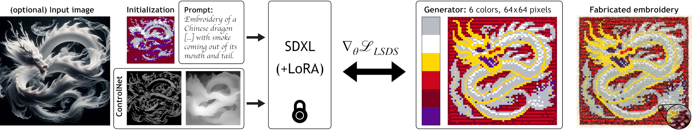
<p><strong>SD-πXL</strong>: Generating Low-Resolution Quantized Imagery via Score Distillation.</p>
</div>
<p align="center">
    <a href="#introduction">Introduction</a> •
    <a href="#installation">Installation</a> •
    <a href="#quickstart">Quickstart</a> •
    <a href="#guide">User Guide</a> •
    <a href="#citation">Citation</a> •
    <a href="#acknowledgement">Acknowledgment</a> •
    <a href="#license">License</a>
</p>


<h2 align="center" id="introduction">👾 Introduction</h2>

This is the codebase for our work **SD-πXL: Generating Low-Resolution Quantized Imagery via Score Distillation**, which will be presented at SIGGRAPH Asia 2024. SD-πXL is designed to create low-resolution, color-limited images like pixel art, which are popular in video games and digital design. This tool allows users to input a text prompt or an image, choose a specific image size and color palette, and then automatically generates the desired artwork. SD-πXL ensures the images are both aesthetically pleasing and useful for practical applications like cross-stich embroidery. Our technical paper with detailed explanations can be found [here](https://doi.org/10.1145/3680528.3687570).


<h2 align="center" id="installation">🔧 Installation</h2>
<p align="right"><a href="#title"><sup>▴ Back to top</sup></a></p>

Prior to running the code, it is advised to create a virtual environment. You can simply do so via the following command:

```bash
conda env create -f environment.yml
```

You can also manually install the required packages via

```bash
conda create --name SD-piXL python=3.10
conda activate SD-piXL
pip3 install torch torchvision torchaudio
pip install matplotlib accelerate omegaconf einops transformers scipy tensorboard openai-clip xformers opencv-python
pip install git+https://github.com/huggingface/diffusers
pip3 install -U scikit-learn
pip install -U peft
```


<h2 align="center" id="quickstart">⏱️ Quickstart</h2>
<p align="right"><a href="#title"><sup>▴ Back to top</sup></a></p>

After installing the dependencies, simply run.

```bash
accelerate launch main.py -c config.yaml --download
```

The first time you run SD-πXL, it might take some time during initialization because the program downloads the necessary model weights from 🤗 Hugging Face. As our approach is based on optimization instead of deep neural network inference, it can be quite slow (as in *takes a few hours to complete*). It also requires a lot of VRAM (24GB is recommended). To decrease the memory requirements, see the section <a href="#memory-requirements">Memory Requirements</a>.

After completion of the program, intermediate and final results are stored in `workdir/config/folderName` where the `folderName` is generated based on the date of execution. With the default config file, you should obtain the following result.

<p align="center">
  <table>
    <tr>
      <td></td>
      <td></td>
      <td></td>
    </tr>
    <tr>
      <td align="center">Input Image</td>
      <td align="center">SD-πXL Output (argmax)</td>
      <td align="center">SD-πXL Output (softmax)</td>
    </tr>
  </table>
</p>

SD-πXL saves intermediate model checkpoints (every 5000 steps - can be changed with the `--save_step` argument.) The following section provides detailed instructions on how to adjust parameters to achieve various outcomes.


<h2 align="center" id="guide">📜 User Guide</h2>
<p align="right"><a href="#title"><sup>▴ Back to top</sup></a></p>

### Run

The full command is

```bash
accelerate launch main.py --config [CONFIG] --seed [SEED_ID] -pt [PROMPT] -npt [NEGATIVE_PROMPT] --download --input_image [SRC_INPUT_IMG] --size [H,W] --palette [SRC_PALETTE] --verbose --make_video --video_size [H,W] --fps [FPS] 
```

Each of these arguments have default value either in `main.py`, either in the config file. We explain below each argument.

- `--config`: Config file. Default is set to `config.yaml`
- `--seed`: Seed. Default is is the config file. 
- `-pt`: Prompt. Default is is the config file.
- `-npt`: Negative prompt. Default is is the config file.
- `--download`: if added, will download the required resources, such as SDXL's weights, ControlNet's weights, etc. Will only download them the first time they are needed.
- `--input_image`: used input image for conditionning the generation. Default is in the config file.
- `--size`: size of the generated image. Default is in the config file. To be provided as a tuple, example: `--size 64,64`
- `--palette`: path to the used palette. Default is in the config file.
- `--verbose`: run with [verbose mode](#verbose).
- `--make_video`: will create a video from the saved intermediate steps.
- `--video_size`: size of the video. Default is `512,512`
- `--fps`: FPS of the video, default is `30`

#### Example:

```bash
accelerate launch main.py --config config.yaml --seed 0 -pt "a Chinese dragon flying through the air on a dark background with smoke coming out of its mouth and tail." -npt "" --download --input_image assets/image/chinese_dragon.png --size 96,96 --palette assets/palettes/lospec/neon-space.hex --verbose --make_video --video_size 288,288 --fps 24
```

#### Result

<p align="center">
  <table>
    <tr>
      <td>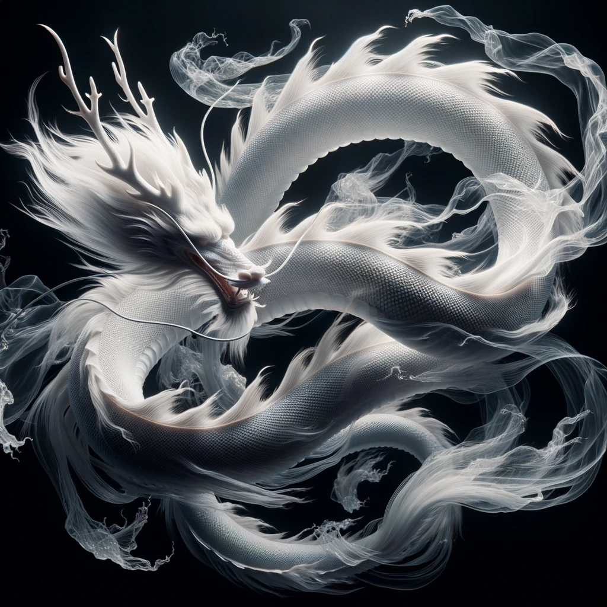</td>
      <td>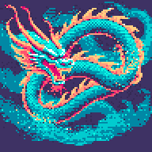</td>
      <td>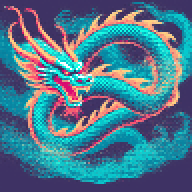</td>
      <td>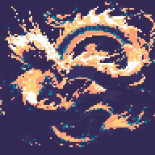</td>
    </tr>
    <tr>
      <td align="center">Input Image</td>
      <td align="center">SD-πXL Output (argmax)</td>
      <td align="center">SD-πXL Output (softmax)</td>
      <td align="center">Video (compressed as a gif)</td>
    </tr>
  </table>
</p>

### Verbose

By adding `--verbose` to the command, you will enter verbose mode. Not only will you save intermediate results, but the programm will also:

- Save the input image.
- Save the ControlNet conditioning images, typically the Canny edge and Depth map of the input image.
- Save the gradients. The saved gradient is taken at a randomly sampled `t` value.
- Save the entropy per pixel.
- Save the results of the Gumbel-Reparameterized generation (both soft- and argmax), in addition to the non-Gumbel reparameterized versions. 
- Save the augmented image of the current iteration.
- Log the variance, entropy, and max probability with tensorboard. Run `tensorboard --logdir workdir/Path/tensorboard/` to visualize them.
- Log more states of the program, such as additional loss information.


<p align="center">
  <table>
    <tr>
      <td></td>
      <td>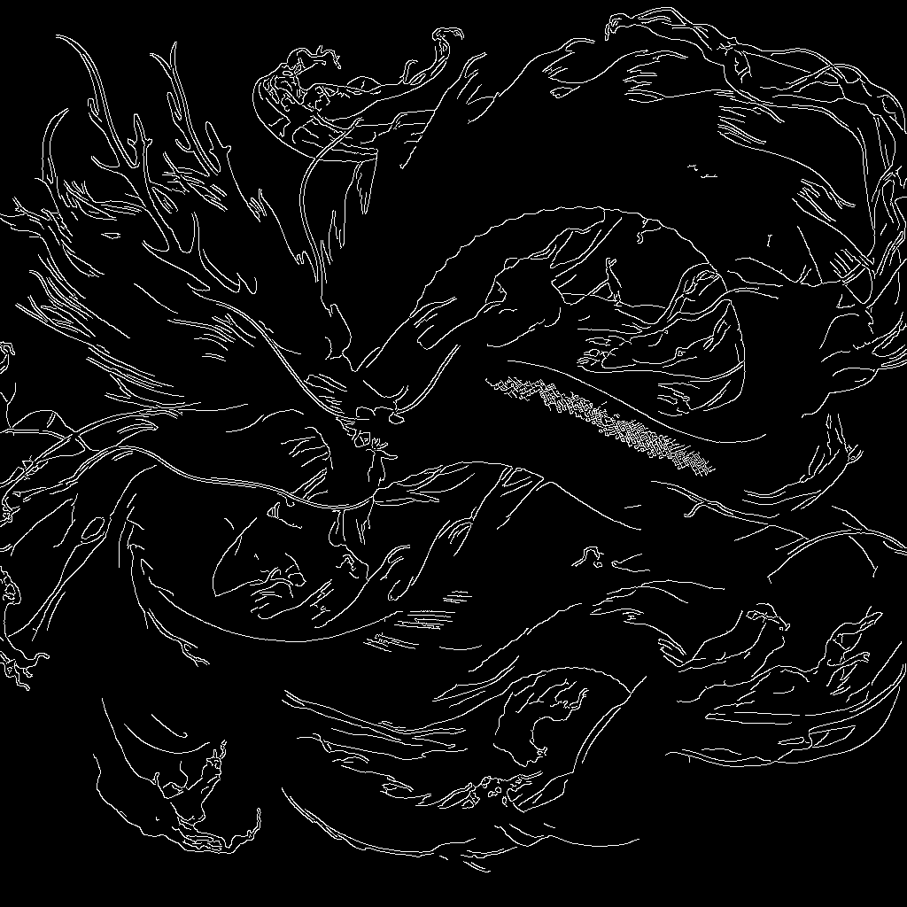</td>
      <td>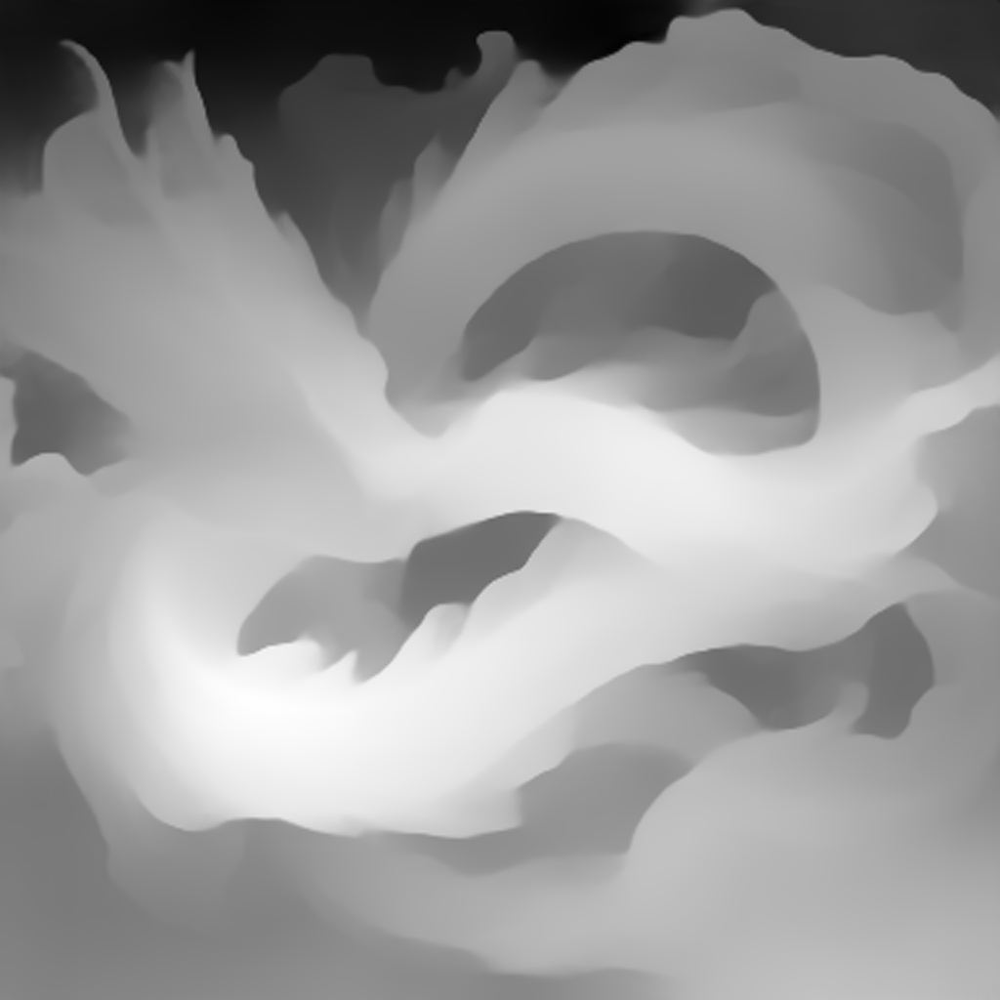</td>
      <td>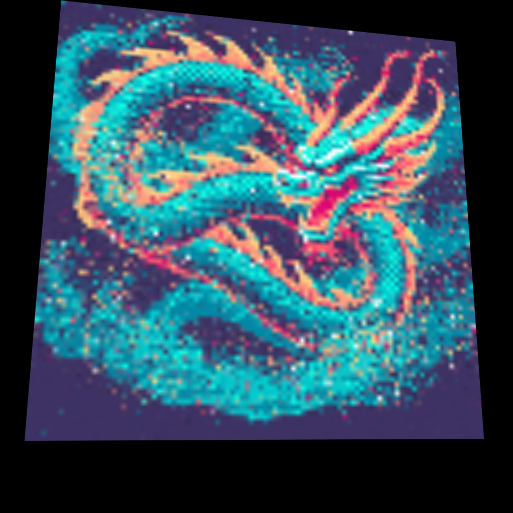</td>
      <td>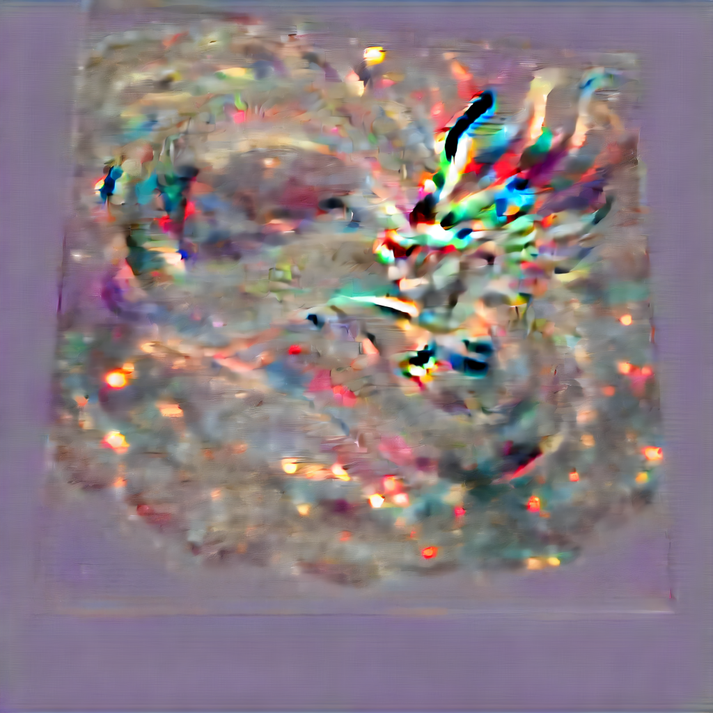</td>
      <td>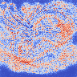</td>
      <td>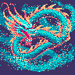</td>
      <td>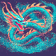</td>
    </tr>
    <tr>
      <td align="center">Initialization</td>
      <td align="center">Canny edge</td>
      <td align="center">Depth map</td>
      <td align="center">Augmentation</td>
      <td align="center">Gradient</td>
      <td align="center">Entropy</td>
      <td align="center">Gumbel-Argmax</td>
      <td align="center">Gumbel-Softmax</td>
    </tr>
  </table>
</p>


### Configuration file

The configuration file must be in the [./config](./config) directory. Only provide the name of the file as input, not the full path. The config file is automatically saved to the result directory. Fields in the given [config/config.yaml](config/config.yaml) are either self-explanatory and commented with possible options, please refer to it. We provide some additional details below.

- **Saving intermediate steps**: `saving_resize` is the size used to save the intermediate and final results. It must be an integer multiple of the target size (`generator.image_H`, `generator.image_W`). Intermediate results are saved every `training.save_steps`.
- **Initialization**: `generator.initialize_renderer` determine whether the renderer is initialized with the input image. The initialization method depends on `initialization_method` and `init_distance`.
- **Kmeans**: if `initialization_method` is set to `kmeans`, then `kmeans_nb_colors` is the number of colors used for the color decomposition.
- **Softmax**: `smooth_softmax` is set `True` to use softmax during training, set to `False` to use argmax otherwise.
- **Gumbel**: `gumbel` whether to use the Gumbel-Softmax reparameterization with parameter `tau`. If you want a crisp pixel art result that adheres exactly to the color palette, set `gumbel` to `True`. If you merely want to have colors that lie in the convex hull of the color palette, set `gumbel` to `False`. If `training.augmentation.random_tau` is `True`, then `tau` will be randomly picked between `random_tau_min` and `random_tau_max`.
- **Optimization**: the optimization will run for `training.steps` steps. Other parameters for the optimizer are self-explanatory in the configuration file.
- **Image augmentation**: The generated image is augmented before being fed to the Latent Diffusion Model. The resize mode is given in `training.resize_mode` ('bilinear' is recommended), and `training.augmentation` allows to modify the graycale probability, horizontal flip probability.
- **Losses**: Different losses can be used with our method. Our paper only presents the Fast Fourier Transform Loss, whose scale can be tweaked via `training.fft_scale` (default 20). Other losses are left for users willing to experiment the program with different smoothing techniques.
- **Diffusion model**: `diffusion.model_id` is either `sdxl`, either `ssbd1`. We recommend using `taesdxl` for the variational autoencoder.
- **ControlNet**: you can toggle off the use of controlnet with `use_controlnet` set to `False`. You can set up either one or two controlnet conditioning (depth or canny), and each of them has three variants and is associated with a controlnet scale. The scales are additive and can produce deformed results if the sum exceeds 1. Removing both controlnet ids leads to an error.
- **LoRA**: you can use any LoRA compatible with SDXL by setting the `diffusion.lora_path` to a correct LoRA id. An example of such id is `nerijs/pixel-art-xl`.
- **Score Distillation**: we provide several parameters for score distillation. The most sensitive is the `guidance_scale`, which controls how the prompt influence the produced image. Refer to the paper for more information. The `sampling_method_t` is set to `bounded_max`, which means that `t` will be sampled uniformly in `[t_min, t_max]`, with `t_max` linearly decreasing to reach `t_bound_max` when the epoch reaches `t_bound_reached × training.steps`.    
- **Image generation**: If no input image is provided, but you still want to initialize the generator by setting `generator.initialize_renderer` to `True`, the program will use the input prompt to generate an image using SDXL. The number of inference steps, the guidance scale and the number of reference images to be generated are configurable.
- **Caption**: If, on the contrary, the you do not want to give a prompt, you can set `automatic_caption` to `True` for SD-πXL to use BLIP to generate a caption for the input image. This caption will then be used as a prompt. 


### Memory requirements

The memory requirements to run SD-πXL can be quite high, and it is recommended to use a GPU with 24GB of VRAM. To decrease the used VRAM, you can modify the config file as such:

- Change the `model_id` from `sdxl` to `ssd1b`. [SSD1B](https://huggingface.co/segmind/SSD-1B) is a distilled 50% smaller version of SDXL.
- Change `canny_mid` and `depth_mid` to `canny_small` and `depth_small`
- Remove either canny or depth conditioning (removing both will result in an error).

Using another model architecture would also yield substantial memory requirement decrease and might even speed up the algorithm (at the potential expense of quality, though). Unfortunately, it would also probably require to rewrite the Score Distillation pipeline for each architecture.


### Palettes

Palettes can be found in [assets/palettes/](assets/palettes/) as `.hex` files. Each line is the hexadecimal code of a color, following the RGB convention.

You can visualize all the palettes in a given folder via the following script

```bash
PYTHONPATH=./ python assets/palettes/palette_show.py --hex_dir=assets/palettes/lospec/
```

The provided palettes in the [assets/palettes/lospec](assets/palettes/lospec) folder are not our production. Visit [Lospec](https://lospec.com/palette-list) for more high quality palettes. We share a few palettes in this repo and attribute them to their respective authors below:

- [slowly](https://lospec.com/palette-list/slowly)
- [Oil 6](https://lospec.com/palette-list/oil-6)
- [Neon Space](https://lospec.com/palette-list/neon-space)

The palettes provided in the two other folders are our own creations. The palettes in the [assets/palettes/lattices](assets/palettes/lattices) are simply a regular decomposition of the RGB cube. For instance, the file `4_4_4_lattice.hex` simply divides each coordinates of the RGB cube in 4, and takes all the colors such that each coordinate , resulting in a color palette of 4×4×4 = 64 colors.

### Visualize Layer decomposition

You can vizualise the result layer by layer via this command.

```bash
python models/pixelart.py --checkpoint=workdir/config/folderName/checkpoint_10000/model_checkpoint.pth --save_dir=results
```

This will save the results in a `results/` folder. On the latter example, you would obtain this:

<p align="center">
  <table>
    <tr>
      <td></td>
      <td></td>
      <td>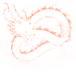</td>
      <td>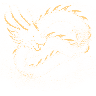</td>
      <td></td>
      <td>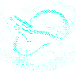</td>
      <td></td>
      <td></td>
      <td></td>
      <td></td>
    </tr>
    <tr>
      <td align="center">Layer 0</td>
      <td align="center">Layer 1</td>
      <td align="center">Layer 2</td>
      <td align="center">Layer 3</td>
      <td align="center">Layer 4</td>
      <td align="center">Layer 5</td>
      <td align="center">Layer 6</td>
      <td align="center">Layer 7</td>
      <td align="center">Layer 8</td>
      <td align="center">Layer 9</td>
    </tr>
  </table>
</p>


You can add a `--palette` argument as long as the palette used as argument has the same size as the palette used to optimize the image generator. For instance, because the palette used was lospec/neon-space.hex with 10 colors, you can use any other 10-color palette:

```bash
python models/pixelart.py --checkpoint=workdir/config/folderName/checkpoint_10000/model_checkpoint.pth --save_dir=results --palette=assets/palettes/other/aqua_verde.hex
```

Alongside the layer decomposition, it also saves the result:

<p align="center">
  <table>
    <tr>
      <td>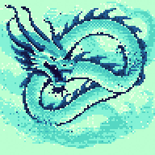</td>
      <td>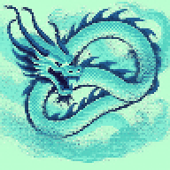</td>
    </tr>
    <tr>
      <td align="center">Argmax - Palette recolor</td>
      <td align="center">Softmax - Palette recolor</td>
    </tr>
  </table>
</p>

### Fabrications

Low-resolution images with low number of colors are particularly suitable for fabrication. You can find an example of such fabrications below.

<p align="center">
  <table>
    <tr>
    <td align="center">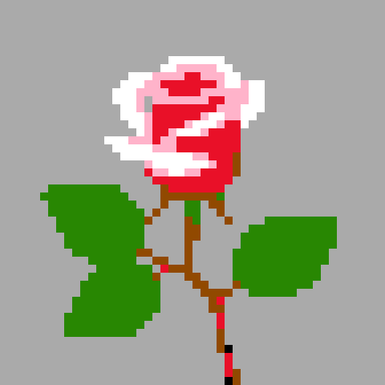</td>
    <td align="center">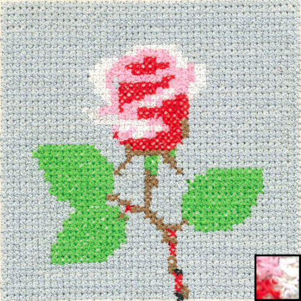</td>
    <td align="center">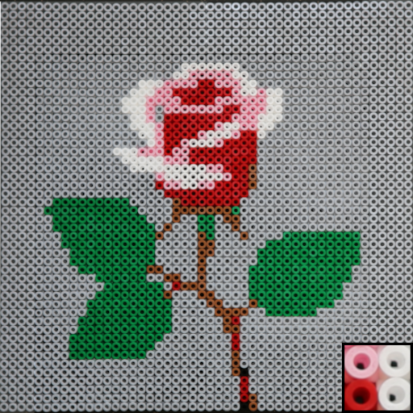</td>
    <td align="center">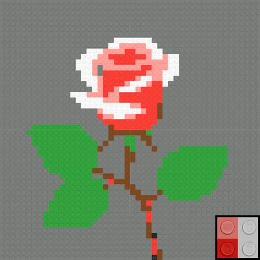</td>
    </tr>
    <tr>
      <td align="center">SD-πXL</td>
      <td align="center">Embroidery</td>
      <td align="center">Fuse beads</td>
      <td align="center">Interlocking bricks</td>
    </tr>
  </table>
</p>


The embroidery was made using PFAFF® creative Icon 2 machine. The interlocking brick was made and rendered using the [Mecabricks](https://www.mecabricks.com/en/workshop) software.


<h2 align="center" id="citation">🪪 Citation</h2>
<p align="right"><a href="#title"><sup>▴ Back to top</sup></a></p>

If this work or this codebase is useful to you, please cite it using the bibtex entry below:

```
@article{Binninger:SDpiXL:2024,
title={SD-piXL: Generating Low-Resolution Quantized Imagery via Score Distillation},
author={Binninger, Alexandre and Sorkine-Hornung, Olga},
journal={SIGGRAPH ASIA 2024, Technical Papers},
year={2024},
doi={10.1145/3680528.3687570}
}
```


<h2 align="center" id="acknowledgements">📢 Acknowledgements</h2>
<p align="right"><a href="#title"><sup>▴ Back to top</sup></a></p>

We thank the anonymous reviewers for their constructive feedback. Ximing Xing's open-source version of VectorFusion was instrumental in the development and design of our source code. This work was supported in part by the European Research Council (ERC) under the European Union’s Horizon 2020 research and innovation program (grant agreement No. 101003104, ERC CoG MYCLOTH).

<h2 align="center" id="license">📃 License</h2>
<p align="right"><a href="#title"><sup>▴ Back to top</sup></a></p>

This repository is licensed under the MIT License. The provided input images in [./assets/image](./assets/image) were produced via DALL·E.